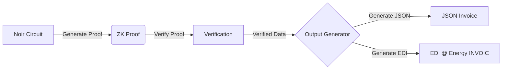

# Noir with Vite and Hardhat

[](https://app.netlify.com/sites/noir-vite-hardhat/deploys)

This example uses [Noir](https://noir-lang.org/) for zero-knowledge circuits, [Vite](https://vite.dev/) as the frontend framework, and [Hardhat](https://hardhat.org/) to deploy and test. The project uses Yarn 4 for package management and Vitest for testing. It is based on the [Noir with Vite and Hardhat Starter](https://github.com/AztecProtocol/noir-starter/tree/main/vite-hardhat).

## Getting Started

Want to get started in a pinch? Start your project in a free Github Codespace!

[](https://codespaces.new/noir-lang/noir-starter/tree/main)

There is also good tutorial at [Noir's official documentation](https://noir-lang.org/docs/tutorials/quickstart) to get started with developing a web app with Noir: [Noir.js app](https://noir-lang.org/docs/tutorials/noirjs_app)

## Local Development

1. Install Yarn 4 if you don't have it already:
   ```bash
   npm install -g yarn
   yarn set version 4.0.0
   ```   

1. Install dependencies:

   ```bash
   yarn install
   ```

2. Run a local Hardhat node in a separate terminal:

   ```bash
   yarn hardhat node
   ```

3. Deploy the verifier contract (UltraPlonk by default):

   ```bash
   yarn deploy
   ```

   This will:

   * Compile your Noir circuit
   * Generate a Solidity verifier contract
   * Deploy the contract to your local network
   * Create a deployment.json file with deployment information

4. Run the development server:

   ```bash
   yarn dev
   ```

   This will start the Vite development server and open your application in the browser.

### Testing

This project uses Vitest for testing. You can run all tests with:

```bash
yarn test
```

For more specific test runs:

```bash
# Run tests in watch mode
yarn test:watch

# Test only UltraPlonk implementation
yarn test:up

# Test only UltraHonk implementation
yarn test:uh
```

The tests demonstrate:

* Generating proofs for Noir circuits
* Verifying proofs off-chain
* Verifying proofs on-chain using the deployed verifier contract

### Project Structure

`packages/noir/` - Contains the Noir circuit

`packages/vite/` - Contains the frontend application

`tests/` - Contains test files for both UltraPlonk and UltraHonk proving systems

### App architecture



### Deploying on other networks

The default scripting targets a local environment. For convenience, we added some configurations for
deployment on various other networks. You can see the existing list by running:

```bash
yarn hardhat vars setup
```

If you want to deploy on any of them, just pass in a private key, for example for the holesky
network:

```bash
yarn hardhat vars set holesky <your_testnet_private_key>
```

You can then deploy on that network by passing the `--network` flag. For example:

```bash
yarn hardhat deploy --network holesky # deploys on holesky
```

Feel free to add more networks, as long as they're supported by `wagmi`
([list here](https://wagmi.sh/react/api/chains#available-chains)). Just make sure you:

- Have funds in these accounts
- Add their configuration in the `networks` property in `hardhat.config.cts`
- Use the name that wagmi expects (for example `ethereum` won't work, as `wagmi` calls it `mainnet`)

### Troubleshooting

#### Missing deployment.json file:

If you encounter errors related to `deployment.json`, make sure you've run `yarn deploy` before starting the development server.

#### Hardhat compilation errors:

If you see Hardhat compilation errors when running `yarn dev`, try running `yarn deploy` again to ensure all contracts are properly compiled.

#### Wagmi generation issues:

If you encounter issues with Wagmi type generation, you can manually run `yarn workspace vite wagmi` to troubleshoot.